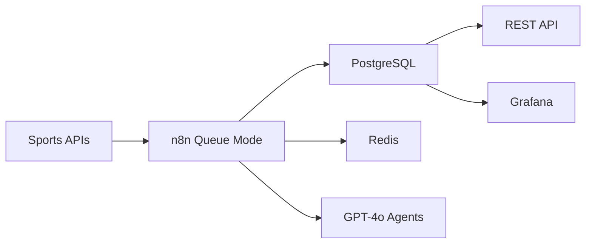

# ⚽ World Cup Intelligence Center (WCIC)

> Plataforma de inteligência esportiva em tempo real para a Copa do Mundo 2026.
> Construída com n8n como orquestrador principal, PostgreSQL, Redis e agentes GPT-4o.

[]()
[]()
[]()
[]()
[]()

---

## O que é este projeto?

O WCIC não é só uma automação, ele é uma plataforma de produto com arquitetura distribuída que demonstra como sistemas de inteligência de dados são construídos em ambientes corporativos reais. 

## Motivação

Este projeto foi desenvolvido para exercitar competências em:

- Arquitetura de automações
- Integração de sistemas
- Engenharia de dados
- Observabilidade
- Inteligência Artificial aplicada
- Desenvolvimento orientado a eventos

O objetivo foi simular um produto utilizado por empresas de mídia esportiva e análise de dados durante grandes eventos esportivos.



**O que o sistema faz:**

- Coleta dados de partidas de múltiplas APIs com fallback e deduplicação
- Monitora eventos ao vivo (gols, cartões, substituições) com latência < 2 minutos
- Analisa notícias com agentes GPT-4o especializados e score de impacto
- Processa sentimento através do Twitter e Reddit durante as partidas
- Gera previsões pré-jogo com probabilidades e justificativa auditável
- Publica relatório diário gerado automaticamente por IA
- Expõe tudo via REST API autenticada para consumidores externos

---

## Arquitetura em números

| Componente | Quantidade |
|---|---|
| Workflows n8n | 12 principais + 7 subworkflows |
| Tabelas PostgreSQL | 15+ com índices e views materializadas |
| Padrões Redis | Cache, Filas, Rate Limiting, Dedup, Circuit Breaker, Pub/Sub |
| Agentes IA | 4 especializados por responsabilidade |
| Canais de notificação | Telegram, Slack, Email, Webhooks |
| Métricas Prometheus | 20+ métricas operacionais e de negócio |

---

## Quick Start

### Pré-requisitos

- Docker e Docker Compose
- Make (opcional, para comandos encurtados)
- Credenciais das APIs externas (ver `.env.example`)

### 1. Clone e configure

```bash
git clone https://github.com/marialuizaleitao/world-cup-intelligence-center.git
cd world-cup-intelligence-center
cp .env.example .env
# Edite .env com suas chaves de API
```

### 2. Suba a infraestrutura

```bash
docker-compose up -d
```

### 3. Inicialize o banco

```bash
./scripts/setup-database.sh
```

### 4. Importe os workflows no n8n

```bash
./scripts/import-workflows.sh
```

### 5. Verifique a conectividade das APIs

```bash
./scripts/test-apis.sh
```

### Acesso aos serviços

| Serviço | URL | Credencial |
|---|---|---|
| n8n | http://localhost:5678 | `.env N8N_BASIC_AUTH_*` |
| Grafana | http://localhost:3000 | admin / `.env GRAFANA_ADMIN_PASSWORD` |
| Metabase | http://localhost:3001 | configurar no primeiro acesso |
| Prometheus | http://localhost:9090 | sem autenticação |
| API WCIC | http://localhost:8080/api/v1 | `X-API-Key` header |

---

## Estrutura do projeto

```
world-cup-intelligence-center/
├── n8n/
│   ├── workflows/          # JSONs exportados do n8n
│   ├── specs/              # Especificações legíveis dos workflows (para code review)
│   └── subworkflows/       # Sub-workflows reutilizáveis
├── database/
│   ├── migrations/         # SQL versionado (executar em ordem)
│   ├── seeds/              # Dados de referência (times, venues)
│   ├── views/              # Materialized views
│   └── queries/            # Queries de exemplo para dashboards
├── services/
│   └── api/                # API REST Node.js/Express
├── infra/
│   ├── monitoring/         # Configurações Prometheus + Grafana
│   ├── backups/            # Scripts de backup e restore
│   └── alerts/             # Definições de alertas
├── docker/                 # Dockerfiles e configs por serviço
├── postman/                # Coleção Postman para testes de API
├── docs/                   # Documentação técnica e operacional
└── scripts/                # Automação de setup e operação
```

---

## Documentação

| Documento | Descrição |
|---|---|
| [ARCHITECTURE.md](./docs/ARCHITECTURE.md) | Visão arquitetural completa |
| [DECISIONS.md](./docs/DECISIONS.md) | ADRs — por que cada tecnologia foi escolhida |
| [DEPLOYMENT.md](./docs/DEPLOYMENT.md) | Guia de deploy em produção |
| [TROUBLESHOOTING.md](./docs/TROUBLESHOOTING.md) | Problemas comuns e soluções |
| [RUNBOOK.md](./docs/RUNBOOK.md) | Procedimentos operacionais |
| [API_REFERENCE.md](./docs/API_REFERENCE.md) | Documentação da REST API |

---

## Padrões Arquiteturais Utilizados

- Event Driven Architecture
- Queue-Based Processing
- Circuit Breaker
- Retry with Exponential Backoff
- Dead Letter Queue
- Cache Aside
- API Gateway Pattern
- AI Agent Orchestration
- Observability First

---

## Roadmap

- [x] Sprint 0 — Estrutura base e documentação
- [x] Sprint 1 — Schema do banco de dados
- [ ] Sprint 2 — WF-01 Match Collector + WF-08 Dashboard Sync
- [ ] Sprint 3 — WF-02 Live Events + WF-07 Notification Hub
- [ ] Sprint 4 — WF-03 News Intelligence + WF-04 Sentiment
- [ ] Sprint 5 — WF-05 AI Predictions + WF-11 Accuracy Tracker
- [ ] Sprint 6 — Observabilidade completa (Grafana + Prometheus)

---

## Objetivos de Performance

| Métrica | Meta |
|----------|----------|
| Event Processing Latency | < 2 min |
| Prediction Generation | < 15s |
| Notification Delivery | < 10s |
| Workflow Success Rate | > 99% |
| API Availability | 99.9% |

---

## Competências técnicas demonstradas

- Orquestração de workflows com n8n em Queue Mode (escala horizontal)
- Arquitetura de integração com múltiplas APIs e fallback automático
- Design de schema relacional para dados de séries temporais
- Padrões de resiliência: Circuit Breaker, Dead-letter Queue, Retry com backoff
- Prompt engineering para agentes IA com outputs estruturados e auditáveis
- Observabilidade com Prometheus e Grafana em ambiente distribuído
- Segurança: validação de webhooks, rate limiting, gerenciamento de secrets
- Containerização de stack completa com Docker Compose
