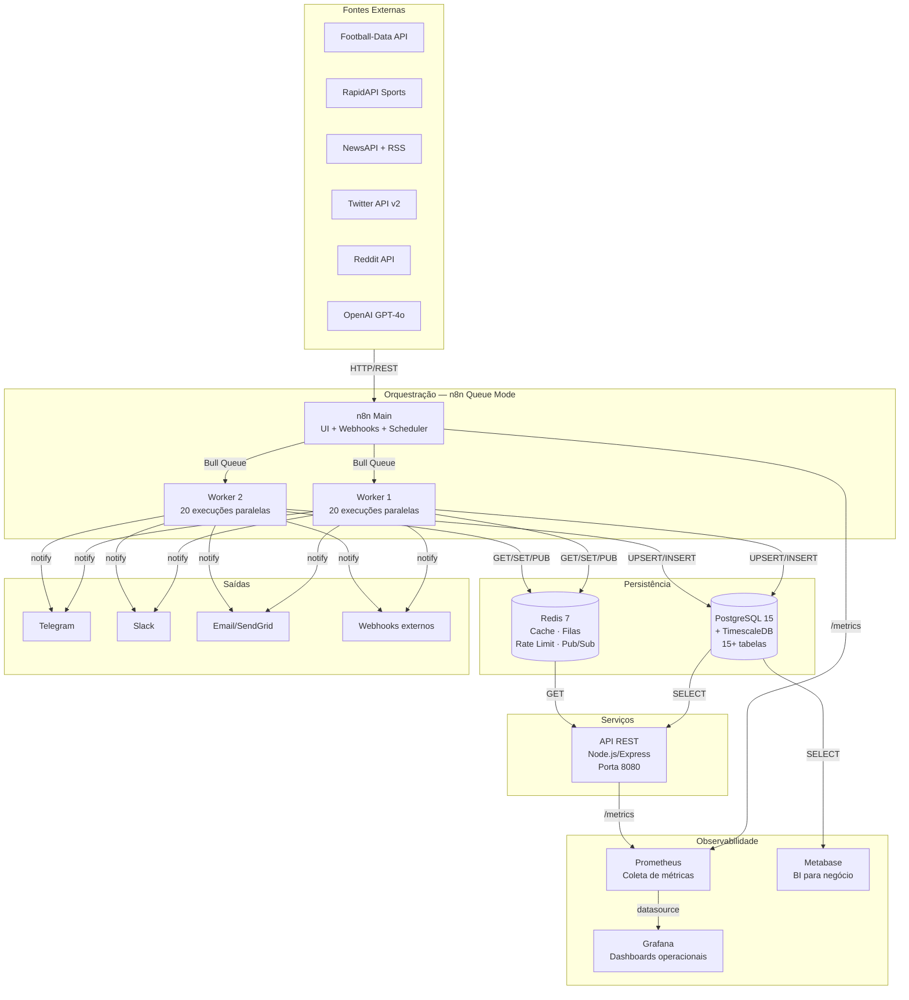
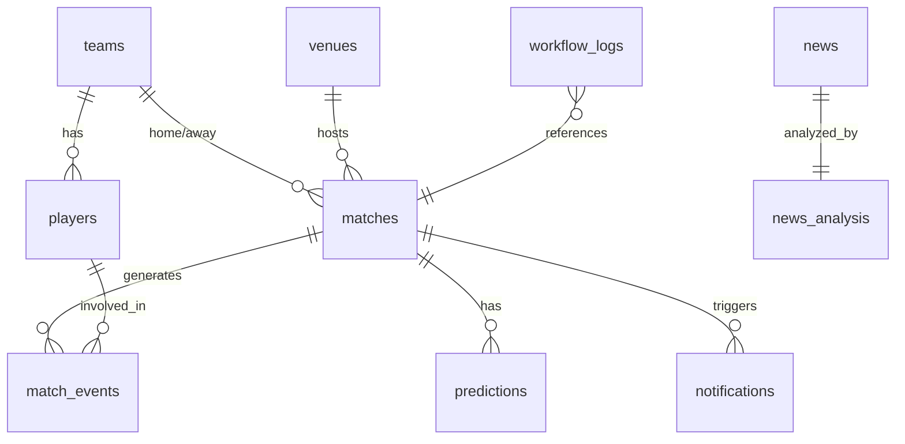
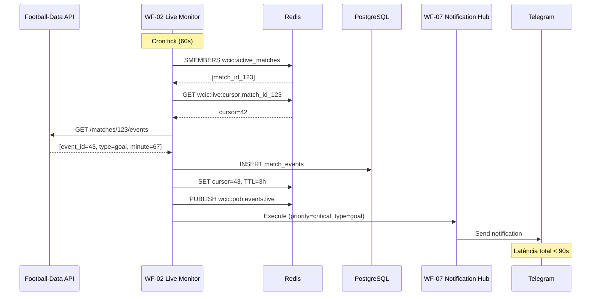
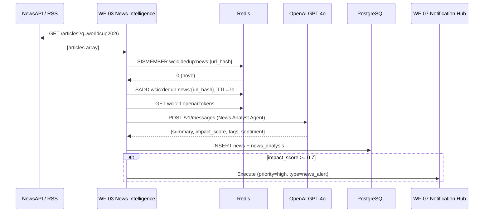
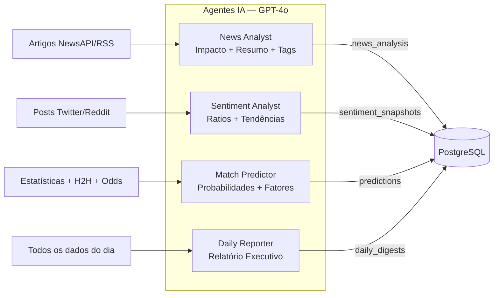
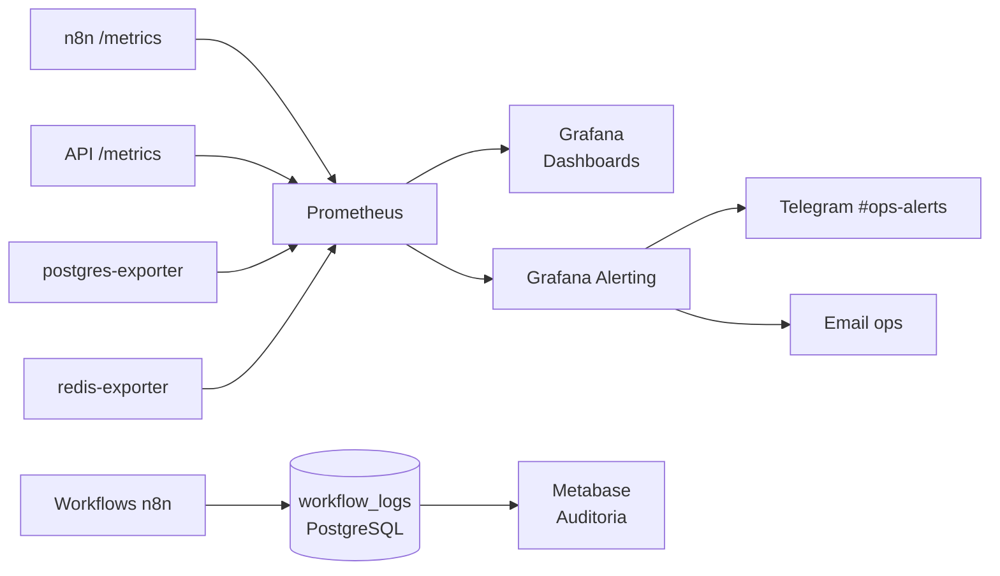

# WCIC — Architecture Document

**Projeto:** World Cup Intelligence Center  
**Versão:** 1.0.0  
**Status:** Em desenvolvimento  
**Última atualização:** Junho 2026

---

## Visão Geral

O World Cup Intelligence Center (WCIC) é uma plataforma de inteligência esportiva distribuída construída para a Copa do Mundo 2026. O sistema coleta dados de múltiplas fontes externas, processa eventos em tempo real, aplica análise de inteligência artificial e distribui insights via múltiplos canais de saída.

O WCIC foi projetado como um produto corporativo real, não como uma prova de conceito, com requisitos explícitos de resiliência, observabilidade, segurança e escalabilidade horizontal.

---

## Objetivos

| Objetivo | Critério de Sucesso |
|---|---|
| Latência de eventos | < 2 minutos entre evento no campo e notificação entregue |
| Disponibilidade | 99,5% durante janelas de jogos |
| Escalabilidade | Suportar 100 jogos simultâneos sem degradação |
| Observabilidade | 100% das execuções rastreáveis por correlation_id |
| Segurança | Zero credenciais em código ou variáveis de ambiente no container |

---

## Arquitetura de Alto Nível



---

## Componentes

### PostgreSQL 15 + TimescaleDB

**Imagem:** `timescale/timescaledb:latest-pg15`  
**Porta:** 5432  
**Container:** `wcic-postgres`

O PostgreSQL é o banco de dados principal da plataforma. A extensão TimescaleDB converte tabelas de alta frequência em hypertables, habilitando particionamento automático por tempo, compressão e queries de séries temporais com performance superior.

**Databases criados:**

| Database | Owner | Propósito |
|---|---|---|
| `n8n` | `n8n_app` | Metadados internos do n8n (workflows, execuções, credenciais) |
| `wcic` | `wcic_app` | Dados da aplicação (partidas, eventos, IA, logs) |
| `metabase` | `metabase_app` | Metadados internos do Metabase |
| `grafana` | `grafana_app` | Metadados internos do Grafana |

**Tabelas principais no schema `wcic`:**



**Hypertables (TimescaleDB):**

| Tabela | Campo de partição | Chunk interval | Retenção |
|---|---|---|---|
| `match_events` | `created_at` | 1 dia | 1 ano |
| `sentiment_snapshots` | `captured_at` | 1 dia | 6 meses |
| `workflow_logs` | `started_at` | 7 dias | 90 dias |

**Configurações de performance aplicadas:**

```
shared_buffers         = 256MB
effective_cache_size   = 512MB
work_mem               = 16MB
maintenance_work_mem   = 64MB
max_connections        = 200
log_min_duration_statement = 1000ms
```

---

### Redis 7

**Imagem:** `redis:7-alpine`  
**Porta:** 6379  
**Container:** `wcic-redis`

O Redis é utilizado em quatro papéis distintos, cada um com namespace isolado:

**1. Cache de API (TTL-based)**
```
wcic:cache:match:{id}          TTL=35min
wcic:cache:odds:{match_id}     TTL=5min
wcic:cache:prediction:{id}     TTL=10min
wcic:cache:dashboard:{view}    TTL=5min
```

**2. Filas de processamento (Bull/BullMQ)**
```
bull:wcic-{workflow-name}:*    Gerenciado pelo n8n Queue Mode
wcic:queue:news_analysis       LIST — artigos para análise IA
wcic:queue:dlq:{workflow}      LIST — dead-letter queue por workflow
```

**3. Estado efêmero e controle**
```
wcic:active_matches            SET — IDs de jogos ao vivo
wcic:live:cursor:{match_id}    TTL=3h — cursor de eventos processados
wcic:circuit:{wf}:{api}        TTL=10min — estado do circuit breaker
wcic:errors:{workflow}         TTL=10min — contador de erros (INCR)
wcic:dedup:news:{url_hash}     TTL=7d — deduplicação de artigos
wcic:dedup:events:{event_id}   TTL=2h — deduplicação de eventos
```

**4. Rate limiting (Token Bucket)**
```
wcic:rl:api:{api}:{window}     TTL=window — tokens disponíveis por API
wcic:rl:notify:{channel}       TTL=1min — limite de notificações
wcic:rl:openai:tokens          TTL=60s — tokens OpenAI por minuto
```

**5. Pub/Sub (event-driven)**
```
wcic:pub:events.live           Canal — eventos ao vivo em tempo real
wcic:pub:match.updated         Canal — atualizações de partidas
wcic:pub:predictions.new       Canal — novas previsões geradas
```

**Configurações aplicadas:**
- `maxmemory 512mb` com política `allkeys-lru`
- `appendonly yes` + `appendfsync everysec` para durabilidade

---

### n8n Main Instance

**Imagem:** `n8nio/n8n:latest`  
**Porta:** 5678  
**Container:** `wcic-n8n-main`  
**Modo:** Queue Mode (EXECUTIONS_MODE=queue)

A instância principal do n8n é responsável exclusivamente por:
- Servir a UI web para gerenciamento de workflows
- Expor o endpoint de webhooks externos
- Agendar execuções via triggers de Cron
- Publicar jobs na fila Bull/Redis para os workers

**A instância principal NÃO executa workflows.** Toda execução é delegada para os workers.

**Workflows hospedados:**

| ID | Nome | Trigger | Frequência |
|---|---|---|---|
| WF-01 | Match Collector | Cron | 30 min |
| WF-02 | Live Event Monitor | Cron | 60s (ao vivo) / 5min |
| WF-03 | News Intelligence | Cron | 15 min |
| WF-04 | Sentiment Analyzer | Cron | 5 min (jogo) / 30 min |
| WF-05 | AI Prediction Engine | Webhook + Cron | Por jogo |
| WF-06 | Daily Digest Generator | Cron | 07:00 BRT diário |
| WF-07 | Notification Hub | Execute Workflow | On-demand |
| WF-08 | Dashboard Sync | Cron | 5 min |
| WF-09 | Data Quality Validator | Cron | 1h |
| WF-10 | Error Recovery | Error Trigger + Cron | 5 min |
| WF-11 | Prediction Accuracy Tracker | Webhook | Pós-jogo |
| WF-12 | API Gateway | Webhook | On-demand |

---

### n8n Workers

**Containers:** `wcic-n8n-worker-1`, `wcic-n8n-worker-2`  
**Concorrência por worker:** 20 execuções paralelas  
**Total de execuções paralelas:** 40 (2 workers × 20)

Os workers consomem jobs da fila Bull/Redis e executam os workflows. São stateless — podem ser escalados horizontalmente adicionando `n8n-worker-N` sem alteração de configuração.

**Escalabilidade:**

| Workers | Execuções paralelas | Carga suportada |
|---|---|---|
| 1 | 20 | MVP / desenvolvimento |
| 2 | 40 | Staging / produção inicial |
| 4 | 80 | Copa completa (100 jogos/dia) |
| N | N×20 | Escala horizontal ilimitada |

---

### API REST (services/api)

**Build:** `./services/api/Dockerfile`  
**Porta:** 8080  
**Container:** `wcic-api`  
**Stack:** Node.js + Express + pg + ioredis

A API REST expõe os dados processados para consumidores externos sem passar pelo n8n (latência menor em operações de leitura).

**Endpoints principais:**

```
GET  /health                        → health check (usado pelo Docker)
GET  /metrics                       → métricas Prometheus
GET  /api/v1/matches                → lista de partidas
GET  /api/v1/matches/:id/events     → eventos de uma partida
GET  /api/v1/predictions/:matchId   → previsões pré-jogo
GET  /api/v1/standings              → tabela de classificação
GET  /api/v1/sentiment/:entityType/:entityId
GET  /api/v1/news/impact            → notícias de alto impacto
GET  /api/v1/digest/latest          → último relatório diário
```

**Autenticação:** API Key via header `X-API-Key`  
**Rate limiting:** 100 req/min por API Key (janela deslizante no Redis)

---

### Grafana

**Imagem:** `grafana/grafana:latest`  
**Porta:** 3000  
**Container:** `wcic-grafana`  
**Database:** `grafana` (PostgreSQL)

O Grafana serve três dashboards distintos com propósitos diferentes:

**Dashboard 1 — Operational Overview**
- Execuções de workflow por minuto e por status
- Taxa de erro por workflow (últimas 24h)
- Latência de APIs externas (p50, p95, p99)
- Estado dos circuit breakers
- Profundidade das filas Bull

**Dashboard 2 — Business Intelligence**
- Tokens OpenAI consumidos (custo estimado USD)
- Acurácia histórica do modelo preditivo
- Volume de notificações por canal
- Score médio de impacto de notícias
- Sentimento agregado por time

**Dashboard 3 — Copa ao Vivo**
- Jogos em andamento com placar em tempo real
- Feed dos últimos eventos (gols, cartões)
- Sentimento ao vivo dos times em campo
- Previsão atual com probabilidades

---

### Prometheus

**Imagem:** `prom/prometheus:latest`  
**Porta:** 9090  
**Container:** `wcic-prometheus`  
**Retenção:** 30 dias

**Targets de scrape:**

| Job | Target | Métricas |
|---|---|---|
| `n8n` | `n8n:5678/metrics` | Execuções, duração, erros, fila |
| `wcic-api` | `api:8080/metrics` | Requests, latência, erros HTTP |
| `postgres` | `postgres-exporter:9187` | Conexões, locks, queries lentas |
| `redis` | `redis-exporter:9121` | Memória, comandos, keyspace |

**Métricas de negócio customizadas (expostas pela API):**

```
wcic_wf_executions_total{workflow, status}
wcic_wf_duration_seconds{workflow} (histogram)
wcic_api_requests_total{endpoint, status_code}
wcic_openai_tokens_used_total{agent}
wcic_openai_cost_usd_total{agent}
wcic_notifications_sent_total{channel, type, status}
wcic_predictions_accuracy_ratio{type}
wcic_active_matches_count
wcic_circuit_breaker_state{workflow, api}
wcic_queue_depth{queue_name}
```

---

### Metabase

**Imagem:** `metabase/metabase:latest`  
**Porta:** 3001  
**Container:** `wcic-metabase`

O Metabase conecta diretamente às materialized views do PostgreSQL e oferece interface amigável para usuários não-técnicos (jornalistas, analistas, clientes).

**Materialized views disponíveis:**

| View | Propósito |
|---|---|
| `mv_group_standings` | Tabela de classificação por grupo |
| `mv_match_summary` | Resumo de partidas com previsões e sentimento |
| `mv_top_scorers` | Artilharia da Copa |
| `mv_prediction_performance` | Performance do modelo preditivo |
| `mv_news_impact_feed` | Feed de notícias de alto impacto |

---

## Fluxos de Dados

### Fluxo 1 — Evento ao Vivo (Gol)



### Fluxo 2 — Análise de Notícia



---

## Arquitetura de IA

O WCIC utiliza quatro agentes GPT-4o especializados, cada um com responsabilidade isolada e prompt versionado:



**Controle de custo:**
- Budget diário configurado em `OPENAI_DAILY_BUDGET_USD`
- Tokens consumidos rastreados por agente no Prometheus
- Rate limiting via Redis token bucket (90.000 tokens/min máximo)
- Fallback: artigos marcados como `pending_analysis` se rate limit atingido

**Rastreabilidade:**
- Toda entrada na tabela de IA registra: `ai_model`, `prompt_version`, `tokens_used`
- `feature_snapshot` (JSONB) em `predictions` preserva os dados exatos usados na predição
- Permite backtesting e auditoria completa

---

## Estratégia de Escalabilidade

### Escala Horizontal dos Workers

O n8n Queue Mode desacopla o scheduler dos executores. Para suportar 100 jogos simultâneos:

```
100 jogos × 60s polling = 100 execuções/min do WF-02
Cada worker processa 20 em paralelo
Necessário: ceil(100/20) = 5 workers
```

Para adicionar workers: duplicar o bloco `n8n-worker-N` no `docker-compose.yml`.

### Cache como Escudo das APIs

Todas as respostas de API são cacheadas no Redis com TTL estratégico, reduzindo chamadas externas em aproximadamente 70-80% durante eventos de alto tráfego.

### Connection Pooling

A API Express usa `pg` com pool de conexões (max 20) para evitar esgotamento de conexões no PostgreSQL. O n8n usa pool interno similar.

### Batch Processing

O WF-02 usa `Split in Batches` para distribuir o processamento de múltiplos jogos entre workers, garantindo que um jogo lento não bloqueie os demais.

---

## Estratégia de Observabilidade



**Três pilares:**
1. **Métricas** — Prometheus + Grafana (tempo real, alertas)
2. **Logs** — `workflow_logs` no PostgreSQL (rastreabilidade, auditoria)
3. **Correlation IDs** — UUID propagado por toda a cadeia de workflows

---

## Estratégia de Segurança

| Camada | Controle |
|---|---|
| Credenciais | Armazenadas exclusivamente no n8n Credentials Manager — nunca em código |
| Variáveis de ambiente | Apenas senhas de infraestrutura no `.env` — nunca commitado |
| Webhooks recebidos | Validação de assinatura HMAC-SHA256 obrigatória |
| API REST | Autenticação via API Key + rate limiting por chave |
| Rede Docker | Rede interna isolada — serviços não acessíveis entre si por porta exposta |
| Banco de dados | Usuário por serviço com privilégios mínimos (princípio do menor privilégio) |
| Senhas geradas | `openssl rand -hex 32` — mínimo 64 chars de entropia |

---

## Estratégia de Backup

**PostgreSQL:**
```bash
# Backup diário via script scripts/backup.sh
docker exec wcic-postgres pg_dump -U postgres wcic | gzip > backup_wcic_$(date +%Y%m%d).sql.gz
```

**Redis:**
- `appendonly yes` garante durabilidade por padrão
- `save 60 1000` cria snapshots RDB periódicos
- Volume `redis_data` persistido pelo Docker

**Volumes Docker:**
- Todos os volumes mapeados para o host via `driver: local`
- Em produção: montar em storage com snapshot automático (EBS, etc.)

---

## Roadmap Técnico

| Fase | Sprint | Entrega |
|---|---|---|
| MVP | 0-1 | Infra + Schema + Seeds |
| MVP | 2 | WF-01 Match Collector + WF-08 Dashboard Sync |
| MVP | 3 | WF-02 Live Events + WF-07 Notification Hub |
| Beta | 4 | WF-03 News Intelligence + WF-04 Sentiment |
| Beta | 5 | WF-05 AI Predictions + WF-11 Accuracy Tracker |
| Produção | 6 | Grafana + Prometheus + Alertas |
| Produção | 7 | WF-09 Data Quality + WF-10 Error Recovery |
| Enterprise | 8 | Multi-tenancy + API pública + SLA |
